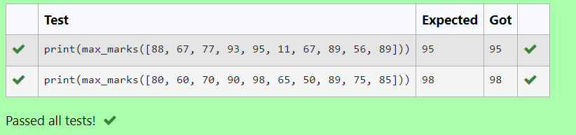

# Find the maximum of a list of numbers
## Aim:
To write a program to find the maximum of a list of numbers.
## Equipment’s required:
1.	Hardware – PCs
2.	Anaconda – Python 3.7 Installation / Moodle-Code Runner
## Algorithm:
1.	Get the list of marks as input
2.	Use the sort() function or max() function or use the for loop to find the maximum mark.
3.	Return the maximum value
## Program:

i) To find the maximum of marks using the list method sort.
``` 
#Program to mark the maximum of marks using the list method sort
Developed by: Harini.B
RegisterNumber: 21000879

def max_marks(marks):
    a=sorted(marks)
    c=a[-1]
    return c
```

ii)	To find the maximum marks using the list method max().
``` 
Program to find the maximum marks using the list method max().
Developed by: Harini.B
RegisterNumber: 21000879

def max_marks(marks):
    l=max(marks)
    return l
```
iii) To find the maximum marks without using builtin functions.
```
Program to the maximum marks without using builtin functions.
Developed by: Harini.B
RegisterNumber: 21000879

def max_marks(list1):
    max_value=0
    for i in list1:
        if i>max_value:
            max_value=i
    return max_value
```
## Output
1.
2.
3.

## Result:
Thus the program to find the maximum of given numbers from the list is written and verified using python programming.